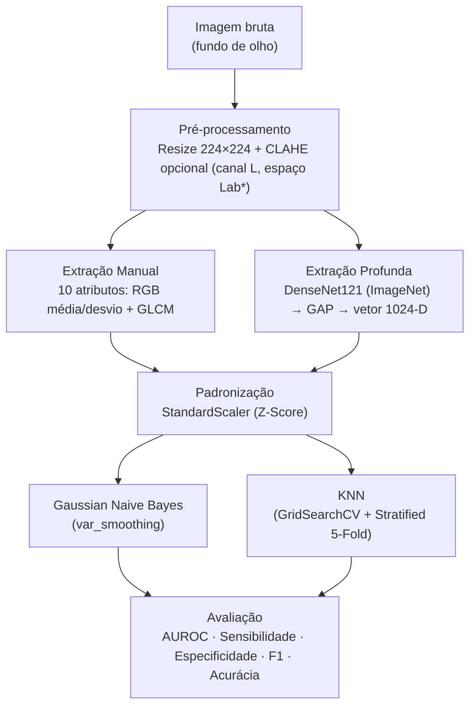

<div align="center">

# Classificação da Retinopatia da Prematuridade (ROP)

**Estudo comparativo entre Machine Learning clássico (engenharia de atributos) e extração profunda de características (Transfer Learning) para o diagnóstico automatizado de ROP em imagens de fundo de olho.**

[](https://www.python.org/)
[](https://pytorch.org/)
[](https://scikit-learn.org/)
[](#-licença)

</div>

---

## Sobre o Projeto

A **Retinopatia da Prematuridade (ROP)** é uma das principais causas de cegueira infantil evitável, mas seu diagnóstico precoce depende de oftalmologistas especializados. Este repositório investiga o quanto de desempenho diagnóstico pode ser recuperado por modelos de **Machine Learning clássico e leve**, comparando duas estratégias de representação de imagem:

- **Engenharia de atributos manual** — estatísticas de cor e textura extraídas diretamente da imagem;
- **Extração profunda (Transfer Learning)** — *embeddings* gerados pelo backbone de uma **DenseNet121** pré-treinada.

Ambas as representações alimentam os **mesmos dois classificadores clássicos** (KNN e Gaussian Naive Bayes), permitindo isolar um único fator experimental: **a origem das características**, não o classificador.

O problema é formulado como uma **classificação binária**:

| Classe | Descrição                                              |
|:---:|--------------------------------------------------------|
| `0` — Normal | Ausência da doença                                     |
| `1` — ROP | Presença de estágios ativos da doença (Estágios 1 a 5) |


> **Dataset:** [A Fundus Image Dataset for Intelligent ROP System (Zhao *et al.*, 2024)](https://doi.org/10.1038/s41597-024-03362-5)
> 
> **Apresentação do projeto:** [https://docs.google.com/presentation/d/1E8AmjCPDQuz9OaBB00if0dPh9K11Etwv/edit?usp=sharing&ouid=111889947619411429650&rtpof=true&sd=true](#)

---

## Dataset

O projeto utiliza o dataset público construído por Zhao *et al.* (2024), publicado na *Scientific Data*:

> Zhao, X., Chen, S., Zhang, S. *et al.* **A fundus image dataset for intelligent retinopathy of prematurity system**. *Sci Data* **11**, 543 (2024). https://doi.org/10.1038/s41597-024-03362-5

- **1.099 imagens** de fundo de olho, de **483 recém-nascidos prematuros**;
- Imagens rotuladas como `Normal`, `Stage1`, `Stage2`, `Stage3` (ROP) e `Laser scars` (cicatrizes de laserterapia pós-tratamento);
- Classificação realizada por três anotadores especialistas.

### Estrutura esperada dos dados

Baixe o dataset original e organize-o na raiz do projeto exatamente como abaixo:

```
ROP dataset/
├── image/
│   ├── Normal/
│   ├── Stage1/
│   ├── Stage2/
│   ├── Stage3/
│   └── ...
└── zip information.xlsx
```

> O dataset **não está incluído neste repositório** (uso e redistribuição sujeitos aos termos dos autores originais). Baixe-o diretamente da fonte oficial antes de rodar qualquer experimento.

---

## Arquitetura do Pipeline

O pipeline foi desenhado de forma **modular**, permitindo estudos de ablação (*ablation studies*) combinando diferentes técnicas de pré-processamento, extração de atributos e classificação.



### 1. Pré-processamento (estático)

| Etapa | Detalhe |
|---|---|
| Redimensionamento | Padronizado para $224 \times 224$ px |
| Realce de contraste | CLAHE opcional, aplicado apenas ao canal de luminosidade **L** no espaço de cor **Lab**, preservando a integridade das cores |

### 2. Extração de características — o coração da comparação

| Estratégia | Técnica | Dimensão do vetor |
|---|---|:---:|
| **Manual (clássica)** | Médias e desvios-padrão dos canais RGB + métricas de textura GLCM (Contraste, Homogeneidade, Energia, Correlação) | 10 |
| **Profunda (CNN Embeddings)** | DenseNet121 pré-treinada (ImageNet), com amputação da camada linear final e Global Average Pooling | 1024 |

### 3. Padronização

`StandardScaler` é aplicado a ambos os tipos de vetor, normalizando média e variância — passo essencial para o cálculo geométrico de distâncias no KNN.

### 4. Classificação

| Modelo | Configuração |
|---|---|
| **Gaussian Naive Bayes** | Modelo probabilístico generativo, com suavização de variância  para estabilidade numérica |
| **K-Nearest Neighbors (KNN)** | Otimizado via `GridSearchCV` + `StratifiedKFold` (5 divisões), buscando automaticamente o melhor **k**, métrica de distância e esquema de peso (`uniform`/`distance`)|

---

## Métricas de Avaliação

Dado o contexto clínico e o desbalanceamento intrínseco dos dados,sendo guiado pelas seguintes métricas:

| Métrica | O que mede |
|---|---|
| **AUROC** | Capacidade fundamental do modelo de separar as classes em diferentes limiares |
| **Sensibilidade (Recall)** | Taxa de acerto em pacientes verdadeiramente doentes — evita Falsos Negativos, os mais críticos clinicamente |
| **Especificidade** | Taxa de acerto em pacientes saudáveis — evita Falsos Alarmes |
| **F1-Score** | Média harmônica entre precisão e recall — métrica de otimização prioritária |
| **Acurácia + Matriz de Confusão** | Frequências absolutas de acertos e erros, para leitura complementar |

>O projeto também aborda variações de threshold de decisão(`0.5`| `0.9`)

---

## Como Executar

### 1. Requisitos

- Python **3.9+**
- Recomenda-se o uso de um ambiente virtual (`venv`)

```bash
python -m venv venv
source venv/bin/activate      # Linux/macOS
venv\Scripts\activate         # Windows
```

Instale as dependências:

```bash
pip install torch torchvision scikit-learn numpy pandas opencv-python scikit-image tqdm matplotlib seaborn openpyxl
```

### 2. Organize o dataset

Baixe o dataset de Zhao *et al.* e posicione-o na raiz do projeto conforme a [estrutura descrita acima](#estrutura-esperada-dos-dados).

### 3. Rodando o experimento completo (batch)

Executa testes totais — cruzando algoritmos, uso de CLAHE e limiares de decisão — e consolida os resultados em uma tabela `.csv` padrão:
> Lembrando que os resultados não são salvos indepedentes e podem ser sobrescritos a cada execução.

```bash
bash run_experiments.sh
```

### 4. Execução individual dos scripts

Para rodar cada cenário separadamente, visualizando métricas no terminal e gráficos salvos em `/results`:

| Script | Cenário |
|---|---|
| `python main_naive_bayes.py` | Baseline — Features manuais + Naive Bayes |
| `python main_knn.py` | Baseline — Features manuais + KNN |
| `python main_naive_bayes_dense.py` | Híbrido — DenseNet Embeddings + Naive Bayes |
| `python main_knn_dense.py` | Híbrido — DenseNet Embeddings + KNN |

---

## Estrutura do Repositório

```
.
├── ROP dataset/                     # Dataset (não versionado — baixar separadamente)
│   ├── image/
│   └── zip information.xlsx
├── results/                         # Métricas, gráficos e tabelas geradas pelos experimentos
├── main_naive_bayes.py              # Baseline: Features manuais + Naive Bayes
├── main_knn.py                      # Baseline: Features manuais + KNN
├── main_naive_bayes_dense.py        # Híbrido: DenseNet Embeddings + Naive Bayes
├── main_knn_dense.py                # Híbrido: DenseNet Embeddings + KNN
├── run_experiments.sh               # Execução total com bash
└── README.md
```

---

## Possíveis Próximos Passos

- [ ] Comparar com a **DenseNet121 completa** (backbone + classificador nativo, fine-tuned), isolando o efeito do classificador final sobre a mesma representação profunda;
- [ ] Adicionar **Grad-CAM** para explicabilidade visual do modelo profundo;
- [ ] Avaliar reamostragem (over/undersampling) para mitigar o desbalanceamento entre classes;
- [ ] Estender a comparação a mais de duas classes (severidade por estágio, em vez de binária).

---

## Contribuindo

Sugestões, correções e *pull requests* são bem-vindos. Para mudanças maiores, abra uma *issue* antes para discutirmos o que gostaria de alterar.
